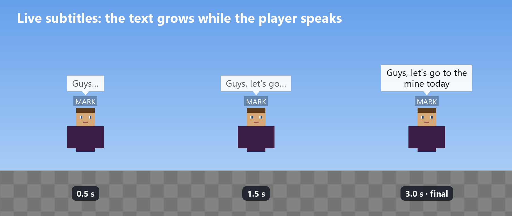
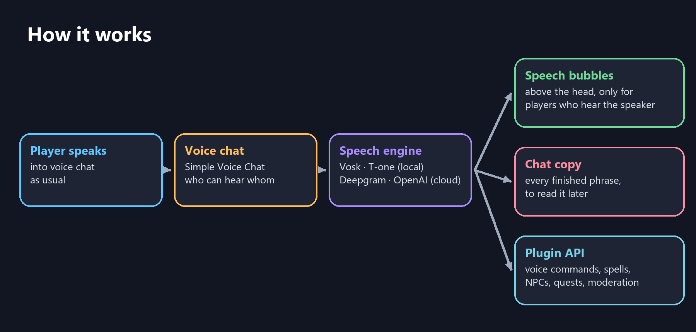
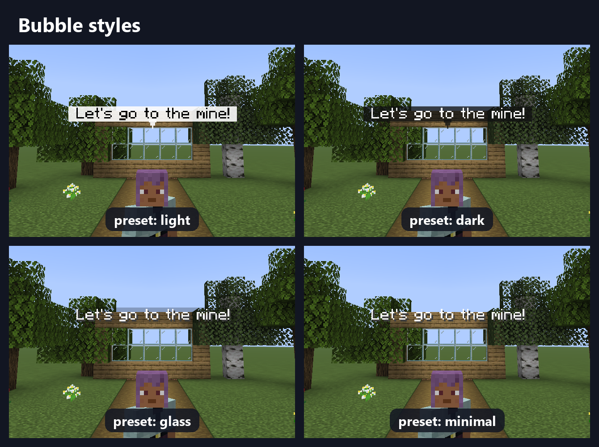

<div align="center">


# SVC-Transcribe

**Real-time speech-to-text for [Simple Voice Chat](https://modrinth.com/plugin/simple-voice-chat).**
Players talk, and everyone who hears them sees their words in speech bubbles above their head.

[](https://github.com/ArabKustam/Simple-Voice-Chat-Transcribe/actions)
[](LICENSE)


[Русская версия](README.ru.md) · [Download](https://github.com/ArabKustam/Simple-Voice-Chat-Transcribe/releases) · [Report a bug](https://github.com/ArabKustam/Simple-Voice-Chat-Transcribe/issues)

</div>



## Features

- **Live subtitles.** The text appears and grows while the player is still speaking, not seconds after.
- **Follows the voice chat.** A bubble is shown only to players who can actually hear the speaker: proximity distance, whispering and groups.
- **No client mods.** Bubbles are vanilla text displays. Players only need Simple Voice Chat itself.
- **Stacked bubbles.** Up to 3 per player: new phrases appear at the head, older ones float up and fade out. Long speech is split into several bubbles.
- **Your style.** Presets (light, dark, glass, minimal) or your own background, text colors, tail, alignment, padding and size.
- **Chat copy.** Every finished phrase also goes to the chat of the players who heard it.
- **Choice of speech engine**, switchable in game:

| Engine | Runs | Languages | Best for |
|---|---|---|---|
| `vosk` | on your server, free | 20+ | Light servers, many languages |
| `t-one` | on your server, free | Russian | Free and accurate Russian |
| `deepgram` | cloud, paid (free credit for new accounts) | many + auto-detect | Best accuracy, punctuation, player names |
| `openai` | cloud, paid | any + auto-detect | Any language |

- **Smart text.** Online players' nicknames are recognised. In Russian, spoken numbers and math become digits and symbols (2 + 2 = 4).
- **Developer API.** Speech start and end, live and final text, phrase triggers, subtitle filters, Bukkit events.
- **Built for busy servers.** Recognition never runs on the main thread, every speaker is processed independently, and there is overload protection.
- **Privacy.** Voice is never saved to disk. Cloud engines receive audio only while someone speaks.



## Requirements

| | |
|---|---|
| Server | Paper, Spigot or Purpur **1.20.2+**, tested on 1.21.8 |
| Java | 17 or newer |
| Voice chat | Simple Voice Chat **2.5+** (Bukkit/Paper version) |
| Players | only the Simple Voice Chat mod |
| First start | internet access: the server downloads libraries from Maven Central and the plugin downloads the speech model |

## Installation

1. Install Simple Voice Chat on the server.
2. Download `SVC-Transcribe-x.y.z.jar` from [Releases](https://github.com/ArabKustam/Simple-Voice-Chat-Transcribe/releases) (or Modrinth) into `plugins/`.
3. Start the server. The plugin picks a free local engine automatically.
4. Optional, for the best accuracy, use Deepgram:
   1. Create a key at [console.deepgram.com](https://console.deepgram.com).
   2. Put it into `engine.deepgram.api-key` in `plugins/SVC-Transcribe/config.yml`.
   3. Run `/svct reload` and `/svct engine deepgram`.

## Commands

| Command | Description | Permission |
|---|---|---|
| `/svct toggle` | Hide or show bubbles for yourself | `svctranscribe.command.toggle` (everyone) |
| `/svct status` | Engine state, load, dropped audio | `svctranscribe.admin.status` |
| `/svct reload` | Reload config and messages | `svctranscribe.admin.reload` |
| `/svct get [section]` | Show settings (API keys are masked) | `svctranscribe.admin.config` |
| `/svct set <option> <value>` | Change **any** config option in game; Tab completes options and values; saved to config.yml | `svctranscribe.admin.config` |
| `/svct engine <auto\|vosk\|t-one\|deepgram\|openai>` | Switch the speech engine live | `svctranscribe.admin.engine` |
| `/svct language <code\|auto>` | Recognition language, `auto` = detect | `svctranscribe.admin.engine` |
| `/svct player <name> <on\|off>` | Enable or disable transcription for a player | `svctranscribe.admin.player` |
| `/svct world <world> <on\|off>` | Enable or disable transcription in a world | `svctranscribe.admin.world` |

More permissions:

| Permission | Default | Meaning |
|---|---|---|
| `svctranscribe.see` | everyone | Sees bubbles |
| `svctranscribe.transcribe` | everyone | Their speech is transcribed |
| `svctranscribe.admin` | op | All admin commands |

## Configuration

Settings can be changed in two ways: edit [`config.yml`](platform-paper/src/main/resources/config.yml) and run `/svct reload`, or change them in game with `/svct set <option> <value>`, for example `/svct set subtitles.style.preset dark`. Every option is documented in the config: language, engine and API keys, bubbles and their look, who sees them, timings, chat copy, number formatting, nickname matching, worlds, performance and debugging. Messages are in `plugins/SVC-Transcribe/lang/` (English and Russian).



```yaml
subtitles:
  max-bubbles: 3
  max-words-per-bubble: 10
  style:
    preset: dark              # light, dark, glass, minimal
    background: "#C81E3A8A"   # #AARRGGBB
    final-format: "&f&l{text}"
    alignment: center
    padding: 2
    scale: 1.2
    tail:
      symbol: "▾"
```

> Minecraft draws text backgrounds as rectangles, so rounded corners would need a resource pack. Everything else works on an unmodified client.

## For developers

SVC-Transcribe and [PV-Transcribe](https://github.com/ArabKustam/Plasma-Voice-Transcribe) (Plasmo Voice) share the same API, so your plugin works with either voice chat without changes. Add the plugin jar as `compileOnly` and `softdepend: [PV-Transcribe, SVC-Transcribe]` to your `plugin.yml`.

```java
PVTranscribeApi api = PVTranscribe.get();

// Live and final text of every player
api.addListener(new TranscriptionListener() {
    @Override public void onSpeechStart(SpeechStartEvent e) { }
    @Override public void onPartialTranscript(Transcript t) { /* still speaking */ }
    @Override public void onFinalTranscript(Transcript t) { /* finished phrase */ }
    @Override public void onSpeechEnd(SpeechEndEvent e) { }
}, api.syncExecutor());

// Voice commands
api.phrases().register(PhraseTrigger.builder("magic:fireball")
        .phrases("fireball", "огненный шар")
        .mode(MatchMode.CONTAINS)
        .matchPartial(true)                // react before the sentence ends
        .executor(api.syncExecutor())      // main thread
        .handler(match -> {
            Player player = Bukkit.getPlayer(match.speakerId());
            if (player != null) player.launchProjectile(Fireball.class);
        })
        .build());

// Moderation: change or hide subtitle text
api.addSubtitleProcessor((transcript, text) -> text.replace("badword", "***"));
```

A `Transcript` has the speaker, `getText()`, `getRawText()`, `getNormalizedText()` (for matching), `isFinal()`, `getUtteranceId()`, the language, the voice source (`simplevoicechat`) and the voice channel (`proximity`, `whisper`, `group`). Bukkit events are also fired on the main thread: `PlayerSpeechStartEvent`, `PlayerTranscriptEvent`, `PlayerSpeechEndEvent`.

## FAQ

**Which Minecraft versions?**
Paper, Spigot and Purpur 1.20.2 and newer (text displays appeared in 1.19.4, smooth movement in 1.20.2). Tested on 1.21.8.

**Does it work with Plasmo Voice?**
Use [PV-Transcribe](https://github.com/ArabKustam/Plasma-Voice-Transcribe). Install only one of the two plugins.

**How accurate is it?**
It depends on the engine. Deepgram is the most accurate: names, punctuation, digits. T-one is a good free choice for Russian. Vosk is the lightest, but it sometimes swaps rare words for similar common ones.

**Is voice recorded?**
No. Audio stays in memory only while it is being recognised. With a cloud engine the audio is sent to that provider while players speak, so tell your players about it.

## Building

```
./gradlew build          # jar in build/libs/
./gradlew runServer      # local test server
```

| Module | Contents |
|---|---|
| `api` | Public API, no Minecraft dependencies |
| `core` | Sessions, threading, subtitles, text formatting |
| `engine-*` | Speech engines |
| `voice-*` | Voice chat adapter |
| `platform-paper` | Bukkit plugin |

## License

[MIT](LICENSE). Third-party components: [THIRD_PARTY.md](THIRD_PARTY.md).
