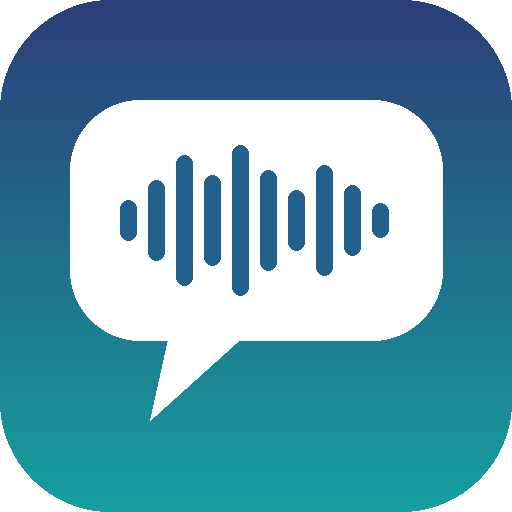
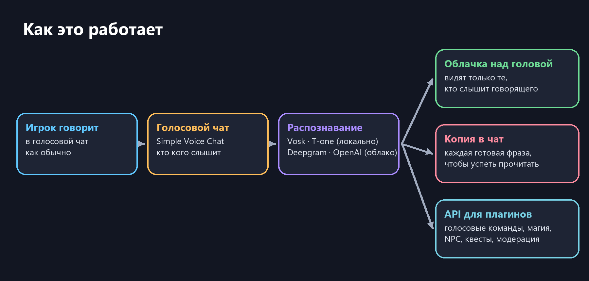

<div align="center">



# SVC-Transcribe

**Распознавание речи из [Simple Voice Chat](https://modrinth.com/plugin/simple-voice-chat) в реальном времени.**
Игрок говорит, и все, кто его слышит, видят его слова в облачке над головой.

[](https://github.com/ArabKustam/Simple-Voice-Chat-Transcribe/actions)
[](LICENSE)


[English version](README.md) · [Скачать](https://github.com/ArabKustam/Simple-Voice-Chat-Transcribe/releases) · [Сообщить об ошибке](https://github.com/ArabKustam/Simple-Voice-Chat-Transcribe/issues)

</div>


## Возможности

- **Живые субтитры.** Текст появляется и растёт, пока игрок ещё говорит, а не через несколько секунд.
- **Работает по правилам голосового чата.** Облачко видят только те, кто реально слышит говорящего: дальность голоса, шёпот и группы.
- **Без модов для субтитров.** Облачка сделаны на обычных text display, игрокам нужен только сам Simple Voice Chat.
- **Несколько облачков.** До 3 над игроком: новая фраза появляется у головы, старые поднимаются вверх и плавно исчезают. Длинная речь делится на несколько облачков.
- **Свой стиль.** Пресеты (light, dark, glass, minimal) или свои цвета фона и текста, хвостик, выравнивание, отступы и размер.
- **Копия в чат.** Каждая законченная фраза приходит в чат тем, кто её слышал.
- **Выбор движка распознавания**, переключение прямо в игре:

| Движок | Где работает | Языки | Лучше всего для |
|---|---|---|---|
| `vosk` | на сервере, бесплатно | 20+ | Слабых серверов и многих языков |
| `t-one` | на сервере, бесплатно | русский | Бесплатного и точного русского |
| `deepgram` | облако, платно (стартовый кредит при регистрации) | много + автоопределение | Максимальной точности, пунктуации, ников |
| `openai` | облако, платно | любые + автоопределение | Любых языков |

- **Умный текст.** Ники онлайн-игроков узнаются. Числа и арифметика пишутся цифрами и знаками (2 + 2 = 4).
- **API для разработчиков.** Начало и конец речи, живой и итоговый текст, триггеры фраз, фильтры субтитров, события Bukkit.
- **Для больших серверов.** Распознавание никогда не идёт в основном потоке, каждый игрок обрабатывается отдельно, есть защита от перегрузки.
- **Приватность.** Голос не сохраняется на диск. Облачные движки получают звук только пока игрок говорит.



## Требования

| | |
|---|---|
| Сервер | Paper, Spigot или Purpur **1.20.2+**, проверено на 1.21.8 |
| Java | 17 и новее |
| Голосовой чат | Simple Voice Chat **2.5+** (Bukkit/Paper version) |
| Игрокам | только мод Simple Voice Chat |
| Первый запуск | нужен интернет: сервер скачает библиотеки, плагин скачает модель распознавания |

## Установка

1. Установите Simple Voice Chat на сервер.
2. Скачайте `SVC-Transcribe-x.y.z.jar` из [Releases](https://github.com/ArabKustam/Simple-Voice-Chat-Transcribe/releases) (или с Modrinth) в `plugins/`.
3. Запустите сервер. Плагин сам выберет бесплатный локальный движок.
4. Для русского языка впишите в `plugins/SVC-Transcribe/config.yml` строки `locale: ru` и `transcription.language: ru`.
5. По желанию, для максимальной точности, подключите Deepgram:
   1. Создайте ключ на [console.deepgram.com](https://console.deepgram.com).
   2. Впишите его в `engine.deepgram.api-key`.
   3. Выполните `/svct reload` и `/svct engine deepgram`.

## Команды

| Команда | Что делает | Право |
|---|---|---|
| `/svct toggle` | Скрыть или показать облачка для себя | `svctranscribe.command.toggle` (все) |
| `/svct status` | Состояние движка, нагрузка, потерянный звук | `svctranscribe.admin.status` |
| `/svct reload` | Перезагрузить конфиг и сообщения | `svctranscribe.admin.reload` |
| `/svct engine <auto\|vosk\|t-one\|deepgram\|openai>` | Сменить движок на лету | `svctranscribe.admin.engine` |
| `/svct language <код\|auto>` | Язык распознавания, `auto` — автоопределение | `svctranscribe.admin.engine` |
| `/svct player <ник> <on\|off>` | Включить или выключить транскрибацию игрока | `svctranscribe.admin.player` |
| `/svct world <мир> <on\|off>` | Включить или выключить транскрибацию в мире | `svctranscribe.admin.world` |

Другие права:

| Право | По умолчанию | Значение |
|---|---|---|
| `svctranscribe.see` | все | Видеть облачка |
| `svctranscribe.transcribe` | все | Речь игрока распознаётся |
| `svctranscribe.admin` | op | Все админские команды |

## Настройка

Все параметры с комментариями есть в [`config.yml`](platform-paper/src/main/resources/config.yml): язык, движок и ключи API, облачка и их вид, кто их видит, тайминги, копия в чат, цифры, ники, миры, производительность и отладка. Тексты сообщений лежат в `plugins/SVC-Transcribe/lang/` (английский и русский).


```yaml
subtitles:
  max-bubbles: 3
  max-words-per-bubble: 10
  style:
    preset: dark              # light, dark, glass, minimal
    background: "#C81E3A8A"   # #AARRGGBB
    final-format: "&f&l{text}"
    alignment: center
    padding: 2
    scale: 1.2
    tail:
      symbol: "▾"
```

> Фон текста Minecraft рисует только прямоугольным, скруглённые углы возможны только с ресурспаком. Всё остальное работает на обычном клиенте.

## Для разработчиков

У SVC-Transcribe и [PV-Transcribe](https://github.com/ArabKustam/Plasma-Voice-Transcribe) (Plasmo Voice) общий API, поэтому ваш плагин работает с любым голосовым чатом без изменений. Подключите jar плагина как `compileOnly` и добавьте `softdepend: [PV-Transcribe, SVC-Transcribe]` в `plugin.yml`. Пример кода есть в [английском README](README.md#for-developers).

## Частые вопросы

**Для каких версий?**
Paper, Spigot и Purpur 1.20.2 и новее. Проверено на 1.21.8.

**Работает ли с Plasmo Voice?**
Для него есть отдельный плагин [PV-Transcribe](https://github.com/ArabKustam/Plasma-Voice-Transcribe). Ставьте только один из двух.

**Насколько точно?**
Зависит от движка. Deepgram самый точный: ники, пунктуация, цифры. T-one — хороший бесплатный вариант для русского. Vosk самый лёгкий, но иногда заменяет редкие слова на похожие частые.

**Записывается ли голос?**
Нет. Звук хранится только в памяти, пока распознаётся. С облачным движком звук отправляется провайдеру, пока игрок говорит, и об этом стоит предупредить игроков.

## Сборка

```
./gradlew build          # jar в build/libs/
./gradlew runServer      # тестовый сервер
```

## Лицензия

[MIT](LICENSE). Сторонние компоненты: [THIRD_PARTY.md](THIRD_PARTY.md).
